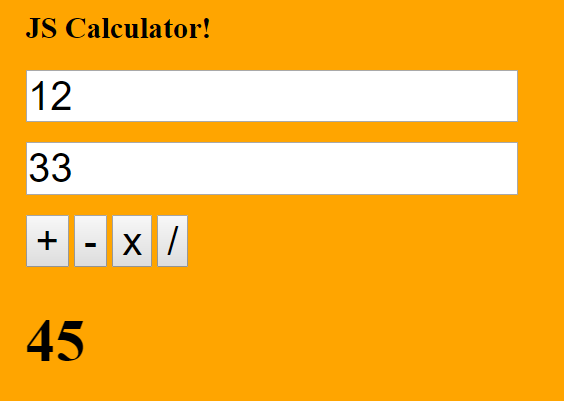
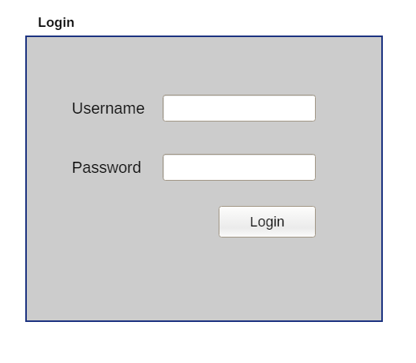

# Week 1 Assignments

## Day 1
#### Fork attainu-pheonix repo, commit and issue a pull request.
1. Signup for a github.com account
2. Fork [https://github.com/attainu-phoenix/attainu-phoenix](https://github.com/attainu-phoenix/attainu-phoenix)
3. Create a file named `why_i_want_to_be_a_coder.md` inside `assignments` folder.
4. Write a short note in the file why you want to be a coder? :)

## Day 2
#### Create an HTML document that looks like the below image.
1. You can either do it on codepen and send us a link or commit to a github repo.


## Day 3
#### Create an "About Me" web page (html and css) with the following contents:
1. A heading with your name.
2. A short paragraph about you.
3. A list of your favourite movies.

## Day 4
#### Create a web-mail page:

1. The web-mail page has three sections.
    1. The left one is for navigation and contains links for Inbox, Sent, Drafts & Trash. You can use an un-ordered list to do that.
    2. The right box is a table of emails with coloumns for From, Subject & Date.
    3. The bottom one is for placing ads.
2. You can use sizes, colors, font etc according to your choice.
3. You can either do it on codepen and send us a link or commit to a github repo.

# Week 2 Assignments

## Day 1

#### Write a Javascript program that prints even numbers from 1 to 100 in descending order
The output should show:
```
100
98
96
.
.
.
2
```

## Day 2

#### Write a Javascript program that prints multiplication table of 5 upto 10.
The output should show:
```
1 * 5 = 5
2 * 5 = 10
.
.
.
10 * 5 = 50
```

## Day 3

#### Create a HTML page with a button that should alert a message when it is clicked

1. Use JS event handler for receiving the click event

## Day 4

#### Create a simple calculator using JS with the UI looking like this -

1. The user input should be validated.
2. All the arithmetic operations should be implemented using functions.

# Week 3 Assignments

## Day 2

#### Create a login page that checks for username and password from the user -

1. The interface should look something like the above image.
2. All the inputs should be validated.
3. Username and password can be hardcoded into the javascript file.

## Day 3

#### Create a company web page using Bootstrap -

Home page -

About Us page -

Contact Us page -


1. Do not use any custom css styles.

# Week 4 assignments

## Day 1

#### Write a Javascript function that takes an array and a value and search that value in the array.
1. Function should take two arguments - an array and a value to search inside the array.
2. If the element is found, the function should return the position of the element in an array.
3. If the element is not found, the function should return "-1".

## Day 3

#### Create a Javascript app that emulates "Stack" behavior.

1. Push button should add value in the textbox to stack.
2. Pop button should remove the last element added to stack.
3. There should be validation for push button. Empty values should not be added to stack.
4. Array can be used as a stack along with push() and pop() methods.
5. During each operation, the stack display area should show the current stack contents.

# Week 5 assignments

## Day 1

#### Create a quiz application with the following features

1. The application should load a random question from the [quiz.json](data/quiz.json) file. Hint - You can use `var randomNumber = Math.floor( Math.random() * 10 )` to get a random number which can be used as an index for the question array.
2. Once the user types an answer in the textbox and clicks Submit, the app should check whether the answer is correct or not. Show a dialog window (prompt) depening up on the right/wrong answer.
3. Also, once the page is loaded, a timer should be started from 30 seconds and go down till 0 second. Once the timer reaches 0, the user should be shown a message saying that `Time is over!` and he/she should not be able to submit an answer after that.
4. For styling and layout, please use Bootstrap.

## Day 5

#### Setup Github hosting for your assignments.

1. Go to [https://pages.github.com/](https://pages.github.com/) and setup a github web hosting repo for your account.
2. Copy all your assignments to the new repo.
3. Create a simple landing page for all your assignments.
4. Publish the page to Github.

# Week 6 assignments

## Day 1

#### Create an Express application with the following features -
1. An express application with four routes that perform addition, subtraction, multiplication and division.
2. The `add` route should take two url parameters and send back their sum.
3. The `sub` route should take two url parameters and send back their difference.
4. The `mul` route should take two url parameters and send back their product.
5. The `div` route should take two url parameters and send back their division result.
